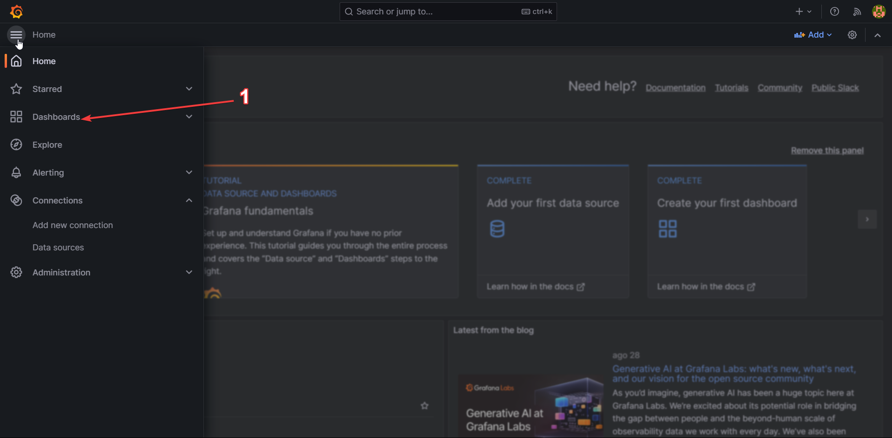
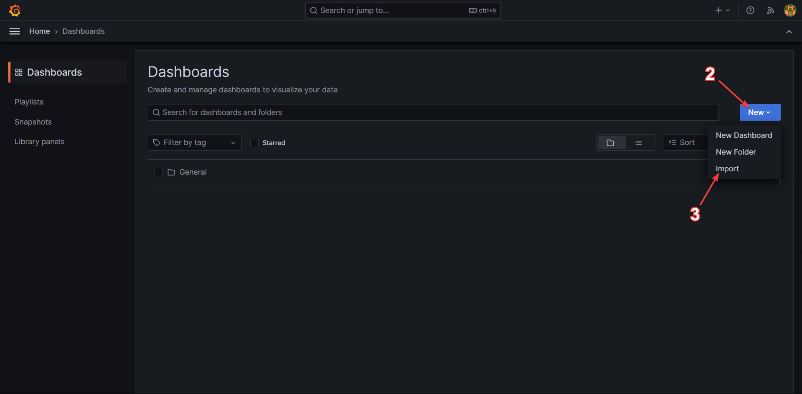
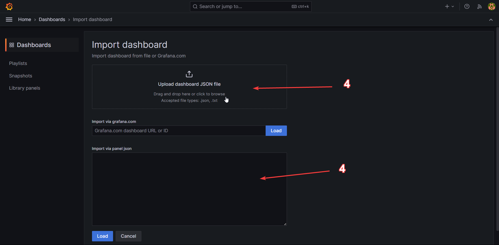
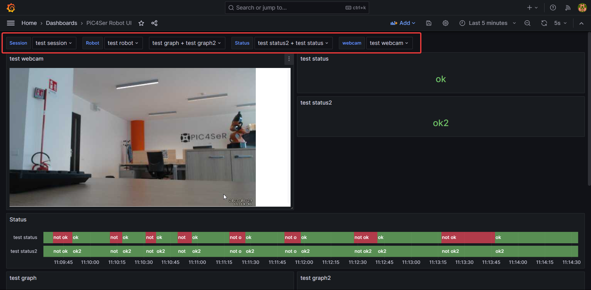

# PiC4Ser ROBOT UI

## Description

This is repository of the Robot UI project. It is a docker stack composed of the following applications:

- A PostgreSQL database
- A redis database
- A Django web application
- A NGINX proxy server
- A Grafana dashboard
- A ROS2 container

In addition to those, there is the motion configuration file needed for streaming video from the robots.

## Configuration

In order to run the stack, you need to configure the following files:

- init-db.sql
- .env

In the first file, change the password strings for the database user (`robot_ui`) and the grafana user (`grafana_user`). For the second file, you can copy the `.env.example` file, rename it to `.env` and change the values of the variables: `POSTGRES_PASSWORD` needs to be the same value as the password of the `robot_ui` database user, `DJANGO_DEBUG` needs to be always `False` except in case of developement. The other 2 variables can be set to something secure, like the output of the following command:

```bash
openssl rand -hex 24
```

To run the stack, you need to have docker and docker-compose installed on your machine. Then clone this repo and run the following command in the folder with the `docker-compose.yml` file:

```bash
docker compose up -d
```

The ros container is only used in development, so it is commented.

The first time the stack is run, 2 folders will be created: `database_data` and `grafana_data`. Those folders are used to store the data of the database and the dashboard. If you want to do backups or moving the stack to another machine while keeping all the database and the dashboard, you can copy those folders.

Before the stack can be used, we need to create a superuser for the Django application. To do that, open a shell inside the `web` container:

```bash
docker exec -it robot-ui-web-1 bash
```

Then run the following command:

```bash
python manage.py createsuperuser
```

You can leave the email field empty, it'll not be used. Then you can exit the shell and open the web application at [`http://localhost:8000/admin`](http://localhost:8000/admin). You can login with the superuser you just created.

## Usage

The data is organized as following:

- Session: a session is a set of robots that send data at a specific time. A session is identified by a name. Multiple active sessions cannot have the same name.
- Robot: a robot is identified by a name. It contains the data of the robot, like metrics, webcams, etc. All the data is sent by the robot to the web application using GraphQL endpoints.
- Data group: a data group is a set of timestamped data that is sent by the robot. It is identified by a name. A robot can have multiple data groups with different names.

These 2 entities are the only ones that need to be created by the user before start sending data from the robot. The other entities are created automatically by the web application when a robot sends data. The other entities are:

- Status: a status is a parameter value that is sent by the robot. It is identified by a name. A robot can have multiple statuses with different names. It is different from a data group only in how it is represented in the dashboard.
- Webcam: robots can register webcam urls in the web app. Those urls are then used to display the video stream in the dashboard. A robot can have multiple webcams.

After creating a session, a robot (and a data group if you want to use it), you can start sending data from the robot. The data is sent using GraphQL endpoints. From the robot, the data can be sent using [this python package](https://github.com/pic4ser-kubernetes/gql-pic4ser) which provides functions for every type of entity in the web app. Examples can be found in the `ros2_ws` folder of this repository, along an example `Dockerfile` which contains everything needed to run the package.

Once the robot has finished streaming, sessions should be set as not active in order not to be displayed as an option in the dashboard and not clash with other sessions with the same name that can be created in the future. This can be done selecting the session in the admin panel, unselcting the `active` checkbox and clicking the save button.

## Webcams

The [dashboard](#dashboard) will try to connect directly to the robot to get the webcam output. This is done using the software motion.
It can be installed on the robot using the following command:

```bash
sudo apt install motion
```

Then the configuration file `motion.conf` needs to be copied in the robot. This file can be found in the `motion` folder of this repository. More info about the configuration file can be found [here](https://motion-project.github.io/motion_config.html). After the configuration file is copied and motion installed, it can be started using the following command:

```bash
motion -c /path/to/motion.conf
```

In order to show the webcam on the dashboard the url needs to be registered in the database. It can be done in the `__init__` method of a node that subclasses the `GQLSendMixin` described above. The url can be registered using the `gql_add_webcam` method. An example can be found in `ros2_ws/src/ui_pkg/subscriber.py`.

## Dashboard

The dashboard where all the data is represented is a Grafana dashboard. It is accessible at [`http://localhost:3000`](http://localhost:3000). The default credentials are `admin` for both username and password and it can be changed after the first login.

An example dashboard is available in this repo in the json file `dashboard.json`. It can be imported in Grafana going in the dashboard section in the left menu, then clicking the `New` button, `Import` and paste the content of the file in the `import via json` field or drag and drop the json file in the drag and drop area.





The dashboard is dynamic and will show the data of the robot that is selected using the settings at the top of the page.



The variables need to be chosen from left to right. Some of them may be multiple choice, in that case you can select multiple values. Robot and session are not one of those, and if you want to monitor multiple robots at once you will need to have a separate tab or window for each of them.

## Controllers

The web app provides 2 websocket endpoints for allowing the robot to receive commands from the user. The endpoints are:

- `/ws/robot/`: every websocket connected to this endpoint will receive the commands sent to the next endpoint
- `/ws/controller/`: the text sent to this endpoint will be forwarded to the websocket connected to the previous endpoint

In the `websocket_utils` folder in this repo there are 2 example scripts:

- `controller.py`: handling controller input and sending it over a websocket
- `receiver.py`: receiving messages from a websocket

Both of these files need to be changed to use the correct websocket url and the receiver script doesn't have any handling of the received message; this can be done in the `on_message` function.

### Known limitations

- The package used for handling controller input (`pyglet`) only works if the computer has a screen. This means that computers controlled over ssh or rdp cannot be used to receive input from the controller using this script.
